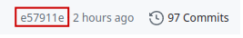

.. _Set up:

Set up
============

Prerequisites
-------------

At least C++17-capable compiler. To check whether your compiler is sufficiently new, see the
`C++ compiler support <https://en.cppreference.com/w/cpp/compiler_support>`_. A version of BLAS
and LAPACK must be available to compile the library. Some possible BLAS/LAPACK implementations are:

* `OpenBLAS <https://www.openblas.net/>`_
* `Intel oneAPI MKL <https://www.intel.com/content/www/us/en/developer/tools/oneapi/onemkl.html>`_

`CMake <https://cmake.org/>`_ with a version of 3.20 or newer. Optionally, if distributed memory 
parallelization (i.e., across multiple nodes) is desired, a version of MPI must be installed and 
accessible. An `OpenMPI <https://www.open-mpi.org/>`_ version since 3.0 is recommended. To toggle 
the use of MPI, please refer to the **Compile options** section below.

CMake integration
-----------------

Lible can be incorporated into your C++ project with ease using the
`FetchContent <https://cmake.org/cmake/help/latest/module/FetchContent.html>`_ module
in modern CMake. All you have to do is write the following lines in the CMakeLists.txt file of your 
project::

   # Enable FetchContent
   include(FetchContent)

   # Declare the Lible dependencies to be fetched
   FetchContent_Declare(lible
       GIT_REPOSITORY https://github.com/MihkuU/Lible
       GIT_TAG        xxxxxx)

   # Make the dependencies available
   FetchContent_MakeAvailable(lible)

   # Link against your target. Necessary for actually building Lible
   target_link_libraries(your_target PRIVATE lible::lible)

This automatically downloads Lible and makes its sources part of your CMake project. When you build
your project, Lible now gets built along with. No additional effort or installation is required, and
you may proceed with using what the library offers. Note that a specific git tag for ``xxxxxx`` has 
to be provided to choose a particular version of a commit from the repo. A tag typically looks like 
this on the git webpage:

.. note::
   This approach supports setting or disabiling options that enable certain features from the library,
   such as using MPI. An example will be provided below.

Manual installation
-------------------

To build and install Lible from its sources, first download the ZIP-file from the
`git page <https://github.com/MihkuU/Lible>`_
or clone the repo into your location of preference::

   git clone git@github.com:MihkuU/Lible.git

In the next step, configure the project::

   cmake -S <your_lible_root_dir> -B <your_build_dir>

Here, various possible options can be given to CMake to yield the desired configuration. This will 
be elaborated on more in the next section. For now, consider the two popular 
`CMAKE_BUILD_TYPE <https://cmake.org/cmake/help/latest/variable/CMAKE_BUILD_TYPE.html#variable:CMAKE_BUILD_TYPE>`_
options::

   -DCMAKE_BUILD_TYPE=Release # Disables debugging, enables high-level optimizations
   or
   -DCMAKE_BUILD_TYPE=Debug   # Enables debugging, much fewer optimizations

Although, Lible can be built without specifying the build-type, it is good to be wary of these 
options. For achieving high performance, choosing ``-DCMAKE_BUILD_TYPE=Release`` is recommended.

Next, build and install the library by running::

   1. cmake --build <your_build_dir> -j <nprocs>
   2. cmake --install <your_build_dir> --prefix "<your_install_dir>"

The second command puts the appropriate Lible files into the directories ``include/`` and ``lib/``,
starting from ``"<your_install_dir>"`` (the installation prefix). After a successful installation, 
Lible can be used by including the corresponding ``include/``-directory and linking against the 
library file in ``lib/``. 

CMake can make the last part easier once again, by using the 
`find_package <https://cmake.org/cmake/help/latest/command/find_package.html>`_ command.
In the CMakeLists.txt file in your project, you can write::

   find_package(lible REQUIRED)
   target_link_libraries(your_target PRIVATE lible::lible)

For this to work, cmake must find the Lible-configuration file, ``libleConfig.cmake``. For the sake 
of completeness, it should be mentioned that this file gets typically placed in the directory 
``<your_lible_install_dir>/lib/cmake/lible`` during installation. To include the Lible libraries, 
all you have to do is write::

   -DCMAKE_PREFIX_PATH=<your_lible_install_dir> 

when configuring your project and CMake finds the configuration file from there.

.. _My target:

Compile options
---------------
