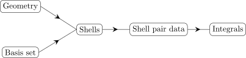
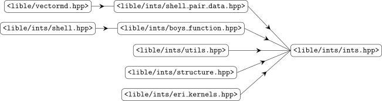

.. _Calculation-of-molecular-integrals:

Integrals
=========

The integrals module (namespace ``lible::ints``) provides utilities to calculate molecular 
integrals over Gaussian-type basis functions. The implementation is based on the 
`McMurchie-Davidson scheme <https://doi.org/10.1016/0021-9991(78)90092-X>`__; calculation of the 
two-electron integrals makes use of the `SHARK algorithm <https://doi.org/10.1002/jcc.26942>`__. 
Some of the notations and conventions here might bear a close resemblance to what is in the 
`"Molecular Electronic-Structure Theory" <https://onlinelibrary.wiley.com/doi/book/10.1002/9781119019572>`__.
This book served as the main reference in implementing the library. In order to use the library, 
include the main header ``<lible/ints/ints.hpp>`` in your source code.
   
Definitions & conventions
-------------------------

Lible provides utilities to calculate molecular integrals over contracted Gaussian type atomic 
orbitals (GTAOs). A contracted GTAO can be written as 

.. math::
   G^{lm}_{\mu} = N_{\mu} \sum^K_{i=1} d_{\mu,i} g^{lm}_{\mu,i}

where :math:`g^{lm}_{\mu,i}` denotes a primitive Gaussian basis function. The contraction depth is 
denoted by :math:`K` and the contraction coefficients by :math:`d_{\mu,i}`. The normalization 
coefficient :math:`N_{\mu}` is usually obtained from the overlap integral

.. math::
   (\mu|\nu) = \int^{\infty}_{-\infty}  (G^{lm}_{\mu} G^{lm}_{\nu}) d^3\mathbf{r}
   \; \Rightarrow \; N_{\mu} = 1.0 / \sqrt{(\mu|\mu)}

The function ``lible::ints::calcShellNorms`` may be used for that purpose. The primitive Gaussian 
basis functions are normalized, and depend on the orbital angular momentum :math:`l` and its 
projection, :math:`m_l = -l, -l + 1, \ldots, l`. Omitting here the :math:`\mu`-label, a primitive 
Gaussian basis function can be written as 

.. math::
   g^{lm}_{i}(\mathbf{r}, \mathbf{a}, \mathbf{A}) = N_{l} (a_i) S_{lm} (\mathbf{r}, \mathbf{A})
   e^{-a_i r^2_A}

The quantities in this expression are defined as:

1. :math:`\mathbf{r} = (x, y, z)` -- an arbitrary point in space.
2. :math:`\mathbf{A} = (A_x, A_y, A_z)` -- point in space where the basis function is centered,
   i.e., a nucleus.

3. :math:`\mathbf{r}_A = (x - A_x, y - A_y, z - A_z)`.
4. :math:`\mathbf{a} = (a_1,\ldots,a_K)` -- list of Gaussian primitive exponents.   
5. :math:`N_{l} (a_i)` -- pure (harmonic) Gaussian primitive normalization coefficient, 
   ``lible::ints::purePrimitiveNorm``, that is calculated analytically from

.. math::
   N_{l}(a_i) = \sqrt{\frac{(2a_i/\pi)^{3/2}(4a_i)^l}{(2l - 1)!!}}

6. :math:`S_{lm} (\mathbf{A})` -- a real-valued solic harmonic. The explicit expressions for these 
   shall not be given here. Essentially, the solid harmonics can be expressed in terms of Cartesian 
   directions through the transformation :math:`t_{lm;ijk}`,

   .. math::
      S_{lm} = \sum_{ijk} t_{lm,ijk} x_A^i y_A^j z_A^k 
   
   where the transformation coefficients are given by given by eq. (9.1.9) in 
   `"Molecular Electronic-Structure Theory" <https://onlinelibrary.wiley.com/doi/book/10.1002/9781119019572>`__.   

The Cartesian to spherical transformation is accessible from the library via the function 
``lible::ints::sphericalTrafo`` which returns the transformation coefficients up to :math:`l=9`. 
Lible follows a convention where the spherical atomic orbitals are ordered *alternatingly* by the 
:math:`m_l` quantum number, as in the table:

+---+---------------------+
| l | :math:`m_l`         | 
+===+=====================+
| 0 | 0                   |
+---+---------------------+
| 1 | 0, 1,-1             |
+---+---------------------+
| 2 | 0, 1,-1, 2,-2       |
+---+---------------------+
| 3 | 0, 1,-1, 2,-2, 3,-3 |
+---+---------------------+

The number of spherical harmonic atomic orbitals is given by :math:`N = 2l + 1`,
``lible::ints::numSphericals``.

The Cartesian Gaussian functions are ordered alphabetically by the Cartesian exponents. For the 
first few angular momenta, :math:`l = 0-3`, the Cartesian exponents are given by:

+-----------+--------------------------------------------------------------------------------------------------------------+
| :math:`l` | Cartesian exponents                                                                                          |
+===========+==============================================================================================================+
| 0         | 1                                                                                                            |
+-----------+--------------------------------------------------------------------------------------------------------------+
| 1         | (1, 0, 0), (0, 1, 0), (0, 0, 1)                                                                              |
+-----------+--------------------------------------------------------------------------------------------------------------+
| 2         | (2, 0, 0), (1, 1, 0), (1, 0, 1), (0, 2, 0), (0, 1, 1), (0, 0, 2)                                             |
+-----------+--------------------------------------------------------------------------------------------------------------+
| 3         | (3, 0, 0), (2, 1, 0), (2, 0, 1), (1, 2, 0), (1, 1, 1), (1, 0, 2), (0, 3, 0), (0, 2, 1), (0, 1, 2), (0, 0, 3) |
+-----------+--------------------------------------------------------------------------------------------------------------+

To get the Cartesian exponents for arbitrary angular momentum, `l`, use ``lible::ints::cartExps``. 
The total number of Cartesian exponents is given by :math:`N = (l + 1)(l + 2) / 2`, 
``lible::ints::numCartesians``.

Available integral kernels
--------------------------

The library provides kernel functions for various integral types. A kernel function calculates 
the integrals for one batch, which is either one shell doublet, triplet or a quartet. In the spirit 
of the SHARK method, all of the kernel functions return the integrals normalized and in a spherical 
basis. The available integral kernels are summarized in the table below:

+-------------------------------------------------------------------------------------------------+-----------------------------------------------------+
| Integral                                                                                        | Function                                            |
+=================================================================================================+=====================================================+
| :math:`(a|b)`                                                                                   | ``lible::ints::overlapKernel``                      |
+-------------------------------------------------------------------------------------------------+-----------------------------------------------------+
| :math:`\boldsymbol{\nabla}_{AB} (a|b)`                                                          | ``lible::ints::overlapD1Kernel``                    |
+-------------------------------------------------------------------------------------------------+-----------------------------------------------------+
| :math:`(a|{-\tfrac{1}{2}}\nabla^2|b)`                                                           | ``lible::ints::kineticEnergyKernel``                |
+-------------------------------------------------------------------------------------------------+-----------------------------------------------------+
| :math:`\boldsymbol{\nabla}_{AB} (a|{-\tfrac{1}{2}}\nabla^2|b)`                                  | ``lible::ints::kineticEnergyD1Kernel``              |
+-------------------------------------------------------------------------------------------------+-----------------------------------------------------+
| :math:`(a|\sum_q \frac{-q}{r_{1q}}|b)`                                                          | ``lible::ints::externalChargesKernel``              |
+-------------------------------------------------------------------------------------------------+-----------------------------------------------------+
| :math:`(a|\sum_q \frac{-q \cdot \text{erf}(\omega r_{1q})}{r_{1q}}|b)`                          | ``lible::ints::externalChargesErfKernel``           |
+-------------------------------------------------------------------------------------------------+-----------------------------------------------------+
| :math:`\boldsymbol{\nabla}_{AB} (a|\sum_q \frac{-q}{r_{1q}}|b)`                                 | ``lible::ints::externalChargesD1Kernel``            |
+-------------------------------------------------------------------------------------------------+-----------------------------------------------------+
| :math:`\boldsymbol{\nabla}_{AB} (a|\sum_q \frac{-q \cdot \text{erf}(\omega r_{1q})}{r_{1q}}|b)` | ``lible::ints::externalChargesErfD1Kernel``         |
+-------------------------------------------------------------------------------------------------+-----------------------------------------------------+
| :math:`\boldsymbol{\nabla}_{q} (a|\frac{-q}{r_{1q}}|b)`                                         | ``lible::ints::externalChargesOperatorD1Kernel``    |
+-------------------------------------------------------------------------------------------------+-----------------------------------------------------+
| :math:`\boldsymbol{\nabla}_{q} (a| \frac{-q \cdot \text{erf}(\omega r_{1q})}{r_{1q}}|b)`        | ``lible::ints::externalChargesOperatorErfD1Kernel`` |
+-------------------------------------------------------------------------------------------------+-----------------------------------------------------+
| :math:`(a|\frac{-q}{r_{1q}}|b)`                                                                 | ``lible::ints::potentialAtExternalChargesKernel``   |
+-------------------------------------------------------------------------------------------------+-----------------------------------------------------+
| :math:`(a| \frac{-q \cdot \text{erf}(\omega r_{1q})}{r_{1q}}|b)`                                | ``lible::ints::potentialAtExternalChargesErfKernel``|
+-------------------------------------------------------------------------------------------------+-----------------------------------------------------+
| :math:`(a|\boldsymbol{\hat{\mu}}_O|b)`                                                          | ``lible::ints::dipoleMomentKernel``                 |
+-------------------------------------------------------------------------------------------------+-----------------------------------------------------+
| :math:`\boldsymbol{\nabla}_{A} \times \boldsymbol{\nabla}_{B} (a|\sum_q \frac{-q}{r_{1q}}|b)`   | ``lible::ints::spinOrbitCoupling1ElKernel``         |
+-------------------------------------------------------------------------------------------------+-----------------------------------------------------+
| :math:`(a|{-\boldsymbol{\nabla}}|b)`                                                            | ``lible::ints::momentumKernel``                     |
+-------------------------------------------------------------------------------------------------+-----------------------------------------------------+
| :math:`(a|{-\boldsymbol{r} \times \boldsymbol{\nabla}}|b)`                                      | ``lible::ints::angularMomentumKernel``              |
+-------------------------------------------------------------------------------------------------+-----------------------------------------------------+
| :math:`(a|\hat{p}_i \hat{V} \hat{p}_j|b)`                                                       | ``lible::ints::pVpKernel``                          |
+-------------------------------------------------------------------------------------------------+-----------------------------------------------------+
| :math:`(ab|\frac{1}{r_{12}}|cd)`                                                                | ``lible::ints::ERI4Kernel::operator()``             |
+-------------------------------------------------------------------------------------------------+-----------------------------------------------------+
| :math:`(ab|\frac{1}{r_{12}}|c)`                                                                 | ``lible::ints::ERI3Kernel::operator()``             |
+-------------------------------------------------------------------------------------------------+-----------------------------------------------------+
| :math:`(a|\frac{1}{r_{12}}|b)`                                                                  | ``lible::ints::ERI2Kernel::operator()``             |
+-------------------------------------------------------------------------------------------------+-----------------------------------------------------+
| :math:`\boldsymbol{\nabla}_{ABCD}(ab|\frac{1}{r_{12}}|cd)`                                      | ``lible::ints::ERI4D1Kernel::operator()``           |
+-------------------------------------------------------------------------------------------------+-----------------------------------------------------+
| :math:`\boldsymbol{\nabla}_{ABC}(ab|\frac{1}{r_{12}}|c)`                                        | ``lible::ints::ERI3D1Kernel::operator()``           |
+-------------------------------------------------------------------------------------------------+-----------------------------------------------------+
| :math:`\boldsymbol{\nabla}_{AB}(a|\frac{1}{r_{12}}|b)`                                          | ``lible::ints::ERI2D1Kernel::operator()``           |
+-------------------------------------------------------------------------------------------------+-----------------------------------------------------+
| :math:`(\boldsymbol{\nabla}_{AB} \otimes \boldsymbol{\nabla}_{AB})(a|\frac{1}{r_{12}}|b)`       | ``lible::ints::ERI2D2Kernel::operator()``           |
+-------------------------------------------------------------------------------------------------+-----------------------------------------------------+
| :math:`\boldsymbol{\nabla}_{A} \times \boldsymbol{\nabla}_{B}(ab|\frac{1}{r_{12}}|cd)`          | ``lible::ints::ERI4SOCKernel::operator()``          |
+-------------------------------------------------------------------------------------------------+-----------------------------------------------------+
| :math:`\boldsymbol{\nabla}_{A} \times \boldsymbol{\nabla}_{B}(ab|\frac{1}{r_{12}}|c)`           | ``lible::ints::ERI3SOCKernel::operator()``          |
+-------------------------------------------------------------------------------------------------+-----------------------------------------------------+

Main Interface
--------------

The integral kernels may be used separately with arbitrarily set up data. In general, however, 
integral calculation in a quantum chemistry programs involves choosing a molecular geometry 
and a basis set. From this data, shells (``lible::ints::Shell``) can be constructed that contain 
all the information required for calculating the integrals. In Lible, the shells are processed 
further to create a special data structure called the *shell pair data* (``lible::ints::ShellPairData``).
Hence, most of the kernel calls involve the shell pair data and require specifying a pair of shells 
with an index. This process may summarized graphically:

It should be noted here, that sometimes, the shells are transformed into the so-called *shell data*
(``lible::ints::ShellData``) data structure. This data structure is used for calculating integrals 
such as :math:`(\mu\nu|P)`.

For convenience, it is possible to calculate some integrals without utilizing the shell pair data.
Lible provides a special data structure that records all the information about geometry, basis sets 
and shells for that purpose: ``lible::ints::Structure``. Using ``lible::ints::Structure``, integrals
can be calculated directly such that the management of shell pair data is done in the backend. 
Graphically this looks as follows: 

.. figure:: path3.png   

This approach can be preferable for testing and prototyping. For large scale implementation, the 
previous scheme is probably preferable. For example, the function ``lible::ints::eri4`` calculates 
all of the four-center two-electron integrals. With large systems, the returned data would become 
too large to be stored in memory. 
   
Let us assume that Lible is properly built/installed and linked against your code. To use the 
library for calculating integrals, include the main header ``#include <lible/ints/ints.hpp>`` in 
your source code. This header file constitutes the main interface. The main interface contains 
inclusions of other Lible header files which may be illustrated diagrammatically:

In the following we shall expose the contents of these header files and provide small usage 
examples of the provided utilities.

Basis and Shells
~~~~~~~~~~~~~~~~

The information content of the previous diagrams is a simplicistic representation of what happens 
in quantum chemical calculations and more specifically, in calculating integrals which is a central
task. Having chosen a molecular geometry and a basis set, the basic building blocks, i.e., the 
shells, can be constructed. This section provides an overview of the contents in 
``<lible/ints/shell.hpp>``.

.. cpp:struct:: lible::ints::BasisShell
   
   Structure representing the basis set of a specific atomic orbital shell.

   .. cpp:var:: int l_

      Angular momentum of the shell.

   .. cpp:var:: std::vector<double> exps_

      Gaussian primitive exponents. 

   .. cpp:var:: std::vector<double> coeffs_

      Contraction coefficients of the Gaussian primitives.      

.. cpp:type:: basis_shells_t = std::vector<lible::ints::BasisShell>

   Type representing a list of basis sets on shells.

.. cpp:struct:: BasisAtom 

   Structure representing the basis set on a specific atom.

   .. cpp:var:: int atomic_nr_

      Atomic number of the atom.

   .. cpp:var:: basis_shells_t basis_shells_

      List of shell basis sets on the atom.

.. cpp:type:: basis_atoms_t = std::vector<BasisAtom>

   Type representing a list of basis sets on atoms. Object of this type can be used to represent 
   the entire molecular basis set (main or auxiliary).

.. cpp:struct:: lible::ints::Shell

   Structure representing an atomic orbital shell. Contains essential data for calculating 
   integrals. rambleramble.

   .. cpp:var:: int l_

      Angular momentum of the shell.

   .. cpp:var:: int z_
      
      Atomic number of the shell's atom.

   .. cpp:var:: size_t dim_cart_

      Number of Cartesian atomic orbitals.

   .. cpp:var:: size_t dim_sph_

      Number of spherical atomic orbitals.

   .. cpp:var:: size_t ofs_cart_

      Starting position of the current shell's Cartesian atomic orbitals in the list of all AOs.

   .. cpp:var:: size_t ofs_sph_

      Starting position of the current shell's spherical atomic orbitals in the list of all AOs.

   .. cpp:var:: size_t idx_

      Index of the current shell in the list of all shells.

   .. cpp:var:: size_t idx_atom_

      Index of the current shell's atom in the list of all atoms.

   .. cpp:var:: std::array<double, 3> xyz_coords_

      Cartesian coordinates of the shell's atom.

   .. cpp:var:: std::vector<double> exps_

      Gaussian primitive exponents.

   .. cpp:var:: std::vector<double> coeffs_

      Contraction coefficients of the Gaussian primitives.      

   .. cpp:var:: std::vector<double> norms_

      Normalization coefficients of the spherical atomic orbitals.

   .. cpp:var:: std::vector<double> norms_prim_

      Normalization coefficients of the Gaussian primitives.
  