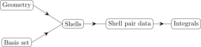
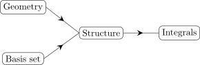
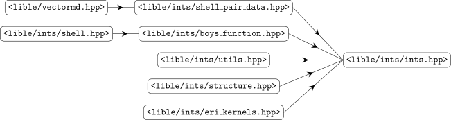

.. _Calculation-of-molecular-integrals:

Integrals
=========

The integrals module (namespace ``lible::ints``) provides utilities to calculate molecular 
integrals over Gaussian-type basis functions. The implementation is based on the 
`McMurchie-Davidson scheme <https://doi.org/10.1016/0021-9991(78)90092-X>`__; calculation of the 
two-electron integrals makes use of the `SHARK algorithm <https://doi.org/10.1002/jcc.26942>`__. 
Some of the notations and conventions here might bear a close resemblance to what is in the 
`"Molecular Electronic-Structure Theory" <https://onlinelibrary.wiley.com/doi/book/10.1002/9781119019572>`__.
This book served as the main reference in implementing the library. In order to use the library, 
include the main header ``<lible/ints/ints.hpp>`` in your source code.
   
Definitions & conventions
-------------------------

Lible provides utilities to calculate molecular integrals over contracted Gaussian type atomic 
orbitals (GTAOs). A contracted GTAO can be written as 

.. math::
   G^{lm}_{\mu} = N_{\mu} \sum^K_{i=1} d_{\mu,i} g^{lm}_{\mu,i}

where :math:`g^{lm}_{\mu,i}` denotes a primitive Gaussian basis function. The contraction depth is 
denoted by :math:`K` and the contraction coefficients by :math:`d_{\mu,i}`. The normalization 
coefficient :math:`N_{\mu}` is usually obtained from the overlap integral

.. math::
   (\mu|\nu) = \int^{\infty}_{-\infty}  (G^{lm}_{\mu} G^{lm}_{\nu}) d^3\mathbf{r}
   \; \Rightarrow \; N_{\mu} = 1.0 / \sqrt{(\mu|\mu)}

The function ``lible::ints::calcShellNorms`` may be used for that purpose. The primitive Gaussian 
basis functions are normalized, and depend on the orbital angular momentum :math:`l` and its 
projection, :math:`m_l = -l, -l + 1, \ldots, l`. Omitting here the :math:`\mu`-label, a primitive 
Gaussian basis function can be written as 

.. math::
   g^{lm}_{i}(\mathbf{r}, \mathbf{a}, \mathbf{A}) = N_{l} (a_i) S_{lm} (\mathbf{r}, \mathbf{A})
   e^{-a_i r^2_A}

The quantities in this expression are defined as:

1. :math:`\mathbf{r} = (x, y, z)` -- an arbitrary point in space.
2. :math:`\mathbf{A} = (A_x, A_y, A_z)` -- point in space where the basis function is centered,
   i.e., a nucleus.

3. :math:`\mathbf{r}_A = (x - A_x, y - A_y, z - A_z)`.
4. :math:`\mathbf{a} = (a_1,\ldots,a_K)` -- list of Gaussian primitive exponents.   
5. :math:`N_{l} (a_i)` -- pure (harmonic) Gaussian primitive normalization coefficient, 
   ``lible::ints::purePrimitiveNorm``, that is calculated analytically from

.. math::
   N_{l}(a_i) = \sqrt{\frac{(2a_i/\pi)^{3/2}(4a_i)^l}{(2l - 1)!!}}

6. :math:`S_{lm} (\mathbf{A})` -- a real-valued solic harmonic. The explicit expressions for these 
   shall not be given here. Essentially, the solid harmonics can be expressed in terms of Cartesian 
   directions through the transformation :math:`t_{lm;ijk}`,

   .. math::
      S_{lm} = \sum_{ijk} t_{lm,ijk} x_A^i y_A^j z_A^k 
   
   where the transformation coefficients are given by given by eq. (9.1.9) in 
   `"Molecular Electronic-Structure Theory" <https://onlinelibrary.wiley.com/doi/book/10.1002/9781119019572>`__.   

The Cartesian to spherical transformation is accessible from the library via the function 
``lible::ints::sphericalTrafo`` which returns the transformation coefficients up to :math:`l=9`. 
Lible follows a convention where the spherical atomic orbitals are ordered *alternatingly* by the 
:math:`m_l` quantum number, as in the table:

+---+---------------------+
| l | :math:`m_l`         | 
+===+=====================+
| 0 | 0                   |
+---+---------------------+
| 1 | 0, 1,-1             |
+---+---------------------+
| 2 | 0, 1,-1, 2,-2       |
+---+---------------------+
| 3 | 0, 1,-1, 2,-2, 3,-3 |
+---+---------------------+

The number of spherical harmonic atomic orbitals is given by :math:`N = 2l + 1`,
``lible::ints::numSphericals``.

The Cartesian Gaussian functions are ordered alphabetically by the Cartesian exponents. For the 
first few angular momenta, :math:`l = 0-3`, the Cartesian exponents are given by:

+-----------+--------------------------------------------------------------------------------------------------------------+
| :math:`l` | Cartesian exponents                                                                                          |
+===========+==============================================================================================================+
| 0         | 1                                                                                                            |
+-----------+--------------------------------------------------------------------------------------------------------------+
| 1         | (1, 0, 0), (0, 1, 0), (0, 0, 1)                                                                              |
+-----------+--------------------------------------------------------------------------------------------------------------+
| 2         | (2, 0, 0), (1, 1, 0), (1, 0, 1), (0, 2, 0), (0, 1, 1), (0, 0, 2)                                             |
+-----------+--------------------------------------------------------------------------------------------------------------+
| 3         | (3, 0, 0), (2, 1, 0), (2, 0, 1), (1, 2, 0), (1, 1, 1), (1, 0, 2), (0, 3, 0), (0, 2, 1), (0, 1, 2), (0, 0, 3) |
+-----------+--------------------------------------------------------------------------------------------------------------+

To get the Cartesian exponents for arbitrary angular momentum, `l`, use ``lible::ints::cartExps``. 
The total number of Cartesian exponents is given by :math:`N = (l + 1)(l + 2) / 2`, 
``lible::ints::numCartesians``.

Available integral kernels
--------------------------

The library provides kernel functions for various integral types. A kernel function calculates 
the integrals for one batch, which is either one shell doublet, triplet or a quartet. In the spirit 
of the SHARK method, all of the kernel functions return the integrals normalized and in a spherical 
basis. The available integral kernels are summarized in the table below:

+-------------------------------------------------------------------------------------------------+-----------------------------------------------------+
| Integral                                                                                        | Function                                            |
+=================================================================================================+=====================================================+
| :math:`(a|b)`                                                                                   | ``lible::ints::overlapKernel``                      |
+-------------------------------------------------------------------------------------------------+-----------------------------------------------------+
| :math:`\boldsymbol{\nabla}_{AB} (a|b)`                                                          | ``lible::ints::overlapD1Kernel``                    |
+-------------------------------------------------------------------------------------------------+-----------------------------------------------------+
| :math:`(a|{-\tfrac{1}{2}}\nabla^2|b)`                                                           | ``lible::ints::kineticEnergyKernel``                |
+-------------------------------------------------------------------------------------------------+-----------------------------------------------------+
| :math:`\boldsymbol{\nabla}_{AB} (a|{-\tfrac{1}{2}}\nabla^2|b)`                                  | ``lible::ints::kineticEnergyD1Kernel``              |
+-------------------------------------------------------------------------------------------------+-----------------------------------------------------+
| :math:`(a|\sum_q \frac{-q}{r_{1q}}|b)`                                                          | ``lible::ints::externalChargesKernel``              |
+-------------------------------------------------------------------------------------------------+-----------------------------------------------------+
| :math:`(a|\sum_q \frac{-q \cdot \text{erf}(\omega r_{1q})}{r_{1q}}|b)`                          | ``lible::ints::externalChargesErfKernel``           |
+-------------------------------------------------------------------------------------------------+-----------------------------------------------------+
| :math:`\boldsymbol{\nabla}_{AB} (a|\sum_q \frac{-q}{r_{1q}}|b)`                                 | ``lible::ints::externalChargesD1Kernel``            |
+-------------------------------------------------------------------------------------------------+-----------------------------------------------------+
| :math:`\boldsymbol{\nabla}_{AB} (a|\sum_q \frac{-q \cdot \text{erf}(\omega r_{1q})}{r_{1q}}|b)` | ``lible::ints::externalChargesErfD1Kernel``         |
+-------------------------------------------------------------------------------------------------+-----------------------------------------------------+
| :math:`\boldsymbol{\nabla}_{q} (a|\frac{-q}{r_{1q}}|b)`                                         | ``lible::ints::externalChargesOperatorD1Kernel``    |
+-------------------------------------------------------------------------------------------------+-----------------------------------------------------+
| :math:`\boldsymbol{\nabla}_{q} (a| \frac{-q \cdot \text{erf}(\omega r_{1q})}{r_{1q}}|b)`        | ``lible::ints::externalChargesOperatorErfD1Kernel`` |
+-------------------------------------------------------------------------------------------------+-----------------------------------------------------+
| :math:`(a|\frac{-q}{r_{1q}}|b)`                                                                 | ``lible::ints::potentialAtExternalChargesKernel``   |
+-------------------------------------------------------------------------------------------------+-----------------------------------------------------+
| :math:`(a| \frac{-q \cdot \text{erf}(\omega r_{1q})}{r_{1q}}|b)`                                | ``lible::ints::potentialAtExternalChargesErfKernel``|
+-------------------------------------------------------------------------------------------------+-----------------------------------------------------+
| :math:`(a|\boldsymbol{\hat{\mu}}_O|b)`                                                          | ``lible::ints::dipoleMomentKernel``                 |
+-------------------------------------------------------------------------------------------------+-----------------------------------------------------+
| :math:`\boldsymbol{\nabla}_{A} \times \boldsymbol{\nabla}_{B} (a|\sum_q \frac{-q}{r_{1q}}|b)`   | ``lible::ints::spinOrbitCoupling1ElKernel``         |
+-------------------------------------------------------------------------------------------------+-----------------------------------------------------+
| :math:`(a|{-\boldsymbol{\nabla}}|b)`                                                            | ``lible::ints::momentumKernel``                     |
+-------------------------------------------------------------------------------------------------+-----------------------------------------------------+
| :math:`(a|{-\boldsymbol{r} \times \boldsymbol{\nabla}}|b)`                                      | ``lible::ints::angularMomentumKernel``              |
+-------------------------------------------------------------------------------------------------+-----------------------------------------------------+
| :math:`(a|\hat{p}_i \hat{V} \hat{p}_j|b)`                                                       | ``lible::ints::pVpKernel``                          |
+-------------------------------------------------------------------------------------------------+-----------------------------------------------------+
| :math:`(ab|\frac{1}{r_{12}}|cd)`                                                                | ``lible::ints::ERI4Kernel::operator()``             |
+-------------------------------------------------------------------------------------------------+-----------------------------------------------------+
| :math:`(ab|\frac{1}{r_{12}}|c)`                                                                 | ``lible::ints::ERI3Kernel::operator()``             |
+-------------------------------------------------------------------------------------------------+-----------------------------------------------------+
| :math:`(a|\frac{1}{r_{12}}|b)`                                                                  | ``lible::ints::ERI2Kernel::operator()``             |
+-------------------------------------------------------------------------------------------------+-----------------------------------------------------+
| :math:`\boldsymbol{\nabla}_{ABCD}(ab|\frac{1}{r_{12}}|cd)`                                      | ``lible::ints::ERI4D1Kernel::operator()``           |
+-------------------------------------------------------------------------------------------------+-----------------------------------------------------+
| :math:`\boldsymbol{\nabla}_{ABC}(ab|\frac{1}{r_{12}}|c)`                                        | ``lible::ints::ERI3D1Kernel::operator()``           |
+-------------------------------------------------------------------------------------------------+-----------------------------------------------------+
| :math:`\boldsymbol{\nabla}_{AB}(a|\frac{1}{r_{12}}|b)`                                          | ``lible::ints::ERI2D1Kernel::operator()``           |
+-------------------------------------------------------------------------------------------------+-----------------------------------------------------+
| :math:`(\boldsymbol{\nabla}_{AB} \otimes \boldsymbol{\nabla}_{AB})(a|\frac{1}{r_{12}}|b)`       | ``lible::ints::ERI2D2Kernel::operator()``           |
+-------------------------------------------------------------------------------------------------+-----------------------------------------------------+
| :math:`\boldsymbol{\nabla}_{A} \times \boldsymbol{\nabla}_{B}(ab|\frac{1}{r_{12}}|cd)`          | ``lible::ints::ERI4SOCKernel::operator()``          |
+-------------------------------------------------------------------------------------------------+-----------------------------------------------------+
| :math:`\boldsymbol{\nabla}_{A} \times \boldsymbol{\nabla}_{B}(ab|\frac{1}{r_{12}}|c)`           | ``lible::ints::ERI3SOCKernel::operator()``          |
+-------------------------------------------------------------------------------------------------+-----------------------------------------------------+

Main Interface
--------------

Typically, integral calculation in quantum chemistry programs involves choosing a molecular geometry
and a basis set. From this data, shells (``lible::ints::Shell``) can be constructed that contain 
all the information required for calculating the integrals. In Lible, the shells are taken
to create a special data structure called the *shell pair data* (``lible::ints::ShellPairData``).
Therefore, typical integral calculation with Lible involves the shell pair data and specifying a
pair of shells with an index. Graphically, the flow of data from the initial geometry and basis set
to integral calculation can be illustrated as:

It should be noted here, that sometimes, the shells are transformed into the so-called *shell data*
(``lible::ints::ShellData``) data structure. This data structure can be used for calculating integrals
involving auxiliary basis functions, such as :math:`(\mu\nu|P)`.

For convenience, it is possible to calculate some integrals directly, without utilizing the shell
pair data. Lible provides a special data structure that records all the information about geometry,
basis sets and shells for that purpose: ``lible::ints::Structure``.
Using ``lible::ints::Structure``, integrals can be calculated such that the management of shell pair
data is done under the hood. Graphically, this looks as follows:

This approach can be preferable for testing and prototyping. For large scale implementation, the 
previous scheme is probably preferable. For example, the function ``lible::ints::eri4`` calculates 
all of the four-center two-electron integrals. For large systems, the returned 4D array of integrals
would become too large to be stored in memory.
   
Let us assume that Lible is properly built/installed and linked against your code. To use the 
library for calculating integrals, include the main header ``#include <lible/ints/ints.hpp>`` in 
your source code. This header file constitutes the so-called main interface. The main interface
contains inclusions of some other Lible header files:

In the following we shall expose the contents of the main header file. After that, the documentation
of the other header files will be provided.

\<lible/ints/ints.hpp\>
~~~~~~~~~~~~~~~~~~~~~~~

For the code snippets shown below, assume the following data is available:

.. code-block:: c++

    std::string basis_set = "def2-svp";
    std::string basis_set_aux = "def2-universal-jkfit";
    std::vector<int> atomic_nrs_h2o{8, 1, 1};
    std::vector<std::array<double, 3>> coords_h2o_ang{
        {0.00000, 0.00000, 0.11779},
        {0.00000, 0.75545,-0.47116},
        {0.00000,-0.75545,-0.47116}};

.. cpp:function:: vec2d overlap(const Structure &structure)

    Calculates the overlap integrals. Uses OpenMP parallelization.

    .. code-block:: c++

        lible::ints::Structure structure(basis_set, atomic_nrs, coords_h2o_ang);
        lible::vec2d ovlp_ints = lible::ints::overlap(structure);

.. cpp:function:: vec2d overlapKernel(size_t ipair, const ShellPairData &sp_data)

    Calculates a batch of overlap integrals. The shell pair index ``ipair`` refers to a pair of
    shells in the shell pair data ``sp_data``.

    .. code-block:: c++

        for (size_t ipair = 0; ipair < sp_data.n_pairs_; ipair++)
        {
            // The index `ipair` is used by the kernel function to read the data necessary for
            // integral calculation.
            lible::vec2d ints_batch = lible::ints::overlapKernel(ipair, sp_data);
            ...
        }

.. cpp:function:: std::array<vec2d, 6> overlapD1Kernel(size_t ipair, const ShellPairData &sp_data)

    Calculates a batch of first derivative overlap integrals. Returns the derivative integrals for
    the atomic centers involved in the shell pair (``ipair``):
    :math:`({\partial_A}_x, {\partial_A}_y, {\partial_A}_z, {\partial_B}_x, {\partial_B}_y, {\partial_B}_z)`.

    .. code-block:: c++

        for (size_t ipair = 0; ipair < sp_data.n_pairs_; ipair++)
        {
            std::array<lible::vec2d, 6> ints_batch = lible::ints::overlapD1Kernel(ipair, sp_data);

            // The indices of the atoms (A and B) involved in the integrals batch can be obtained
            // from the shell pair data.
            size_t iatom_a = atomic_idxs_[2 * ipair];
            size_t iatom_b = atomic_idxs_[2 * ipair + 1];
        }

.. cpp:function:: vec2d kineticEnergy(const Structure &structure)

    Calculates the kinetic energy integrals. Uses OpenMP parallelization.

.. cpp:function:: vec2d kineticEnergyKernel(size_t ipair, const ShellPairData &sp_data)

    Calculates a batch of kinetic energy integrals.

.. cpp:function:: std::array<vec2d, 6> kineticEnergyD1Kernel(size_t ipair, const ShellPairData &sp_data)

    Calculates a batch of first derivative kinetic energy integrals.

.. cpp:function:: vec2d nuclearAttraction(const Structure &structure)

    Calculates nuclear attraction integrals. Uses OpenMP parallelization.

.. cpp:function:: vec2d nuclearAttractionErf(const Structure &structure, const std::vector<double> &omegas)

    Calculates the attenuated Coulomb attraction integrals. Uses OpenMP parallelization.

    .. important::
        The number of attenuation parameters ``omegas`` must equal the number of atoms in the
        structure.

.. cpp:function:: vec2d externalCharges(const std::vector<std::array<double, 4>> &point_charges, \
    const Structure &structure)

    Calculates the one-electron Coulomb integrals with given point charges. Uses OpenMP parallelization.

.. cpp:function:: vec2d externalChargesErf(const std::vector<std::array<double, 4>> &point_charges, \
    const std::vector<double> &omegas, const Structure &structure)

    Calculates the attenuated one-electron Coulomb integrals with given point charges. Uses
    OpenMP parallelization.

    .. important::
        The numbers of attenuation parameters ``omegas`` and point charges ``point_charges`` must
        be equal.

.. cpp:function:: vec2d externalChargesKernel(size_t ipair, const std::vector<std::array<double, 4>> &charges, \
    const BoysGrid &boys_grid, const ShellPairData &sp_data)

    Calculates a batch of one-electron Coulomb integrals for a list of given charges.

    .. code-block:: c++

        for (const lible::ints::ShellPairData &sp_data : sp_data_all)
        {
            // The boys grid must be initialized with the angular momentum correct angular momentum:
            auto [la, lb] = sp_data.getLPair();
            int lab = la + lb;
            lible::ints::BoysGrid boys_grid(lab);

            for (size_t ipair = 0; ipair < sp_data.n_pairs_; ipair++)
            {
                lible::vec2d ints_batch = lible::ints::externalChargesKernel(
                    ipair, charges, boys_grid, sp_data);

                // Consume the integrals..
            }
        }

.. cpp:function:: vec2d externalChargesErfKernel(size_t ipair, const std::vector<std::array<double, 4>> &charges, \
    const std::vector<double> &omegas, const BoysGrid &boys_grid, const ShellPairData &sp_data)

    Calculates a batch of attenuated Coulomb integrals.

    .. important::
        The numbers of attenuation parameters ``omegas`` and  charges ``charges`` must be equal.

.. cpp:function:: std::array<vec2d, 6> externalChargesD1Kernel(size_t ipair, \
    const std::vector<std::array<double, 4>> &charges, const BoysGrid &boys_grid, \
    const ShellPairData &sp_data)

    Calculates a batch of first-derivative one-electron Coulomb integrals.

    .. important::
        Due to differentiation, the Boys function grid has to be initialized with total angular
        momentum incremented by one:

        .. code-block:: c++

            auto [la, lb] = sp_data.getLPair();
            int lab1 = la + lb + 1;
            lible::ints::BoysGrid boys_grid(lab1);

.. cpp:function:: std::array<vec2d, 6> externalChargesErfD1Kernel(size_t ipair, \
    const std::vector<std::array<double, 4>> &charges, const std::vector<double> &omegas, \
    const BoysGrid &boys_grid, const ShellPairData &sp_data)

    Calculates a batch of first-derivative attenuated one-electron Coulomb integrals.

    .. important::
        Due to differentiation, the Boys function grid has to be initialized with total angular
        momentum incremented by one:

        .. code-block:: c++

            auto [la, lb] = sp_data.getLPair();
            int lab1 = la + lb + 1;
            lible::ints::BoysGrid boys_grid(lab1);

    .. important::
        The number of the attenuation parameters ``omegas`` must equal the number of
        charges, :math:`(x, y, z, q)`, ``charges``.

.. cpp:function:: std::vector<std::array<vec2d, 3>> externalChargesOperatorD1Kernel(size_t ipair, \
    const std::vector<std::array<double, 4>> &charges, const BoysGrid &boys_grid, \
    const ShellPairData &sp_data)

    Calculates a batch of one-electron Coulomb operator derivative integrals. The returned list of
    integrals has the length of the given charges, ``charges``.

.. cpp:function:: std::vector<std::array<vec2d, 3>> externalChargesOperatorErfD1Kernel(size_t ipair, \
    const std::vector<std::array<double, 4>> &charges, const std::vector<double> &omegas, \
    const BoysGrid &boys_grid, const ShellPairData &sp_data)

    Calculates a batch of attenuated one-electron Coulomb operator derivative integrals. The returned
    list of integrals has the length of the given charges, ``charges``.

    .. important::
        The Boys function grid has to be initialized with total angular momentum of
        :math:`l = l_a + l_b + 1`.

    .. important::
        The number of the attenuation parameters ``omegas`` must equal the number of
        charges, :math:`(x, y, z, q)`, ``charges``.

.. cpp:function:: std::vector<vec2d> potentialAtExternalChargesKernel(size_t ipair, \
    const std::vector<std::array<double, 4>> &charges, const BoysGrid &boys_grid, const ShellPairData &sp_data)

    Calculates a batch of one-electron Coulomb integrals at the given charges, :math:`(x, y, z, q)`.
    Returns a list of integrals with the length of given charges.

.. cpp:function:: std::vector<vec2d> potentialAtExternalChargesErfKernel(size_t ipair, \
    const std::vector<std::array<double, 4>> &charges, const std::vector<double> &omegas, \
    const BoysGrid &boys_grid, const ShellPairData &sp_data)

    Calculates a batch of attenuated one-electron Coulomb integrals at the given charges, :math:`(x, y, z, q)`.
    Returns a list of integrals with the length of given charges.

    .. important::
        The list of charges must have the same length as the attenuated parameters (``omegas``).

.. cpp:function:: std::array<vec2d, 3> dipoleMoment(const std::array<double, 3> &origin, const Structure &structure)

    Calculates dipole moment integrals. Uses OpenMP parallelization.

.. cpp:function:: std::array<vec2d, 3> dipoleMomentKernel(size_t ipair, const std::array<double, 3> &origin, \
    const ShellPairData &sp_data)

    Calculates a batch of dipole moment integrals.

.. cpp:function:: std::array<vec2d, 3> spinOrbitCoupling1El(const Structure &structure)

    Calculates spin-orbit coupling (SOC) one-electron integrals. Uses OpenMP parallelization.

.. cpp:function:: std::array<vec2d, 3> spinOrbitCoupling1ElKernel(size_t ipair, \
    const std::vector<std::array<double, 4>> &charges, const BoysGrid &boys_grid, \
    const ShellPairData &sp_data)

    Calculates a batch of of spin-orbit coupling (SOC) one-electron integrals.

    .. important::
        The boys grid must be initialized with :math:`l = l_a + l_b + 1`.

.. cpp:function:: std::array<vec2d, 3> momentum(const Structure &structure)

    Calculates linear momentum integrals. Uses OpenMP parallelization.

.. cpp:function:: std::array<vec2d, 3> momentumKernel(size_t ipair, const ShellPairData &sp_data)

    Calculates a batch of linear momentum integrals.

.. cpp:function:: std::array<vec2d, 3> angularMomentum(const std::array<double, 3> &origin, \
    const Structure &structure)

    Calculates angular momentum integrals. Uses OpenMP parallelization.

.. cpp:function:: std::array<vec2d, 3> angularMomentumKernel(size_t ipair, \
    const std::array<double, 3> &origin, const ShellPairData &sp_data)

    Calculates a batch of angular momentum integrals.

.. cpp:function:: arr2d<vec2d, 3, 3> pVpIntegrals(const Structure &structure)

    Calculates the :math:`\hat{p}_i \hat{V}\hat{p}_j` integrals. Used in X2C: https://doi.org/10.1063/1.4803693.
    Uses OpenMP parallelization.

.. cpp:function:: arr2d<vec2d, 3, 3> pVpKernel(size_t ipair, const std::vector<std::array<double, 4>> &charges, \
    const BoysGrid &boys_grid, const ShellPairData &sp_data)

    Calculates a batch of :math:`\hat{p}_i \hat{V}\hat{p}_j` integrals.

    .. important::
        The boys grid must be initialized with :math:`l = l_a + l_b + 2`.

.. cpp:function:: std::vector<double> eri2Diagonal(const Structure &structure)

    Calculates the diagonal part of the two-center Coulomb repulsion integrals in auxiliary basis:
    :math:`(K|K)`. Uses OpenMP parallelization.

    .. important::
        The ``structure`` must be initialized with an auxiliary basis set beforehand.

.. cpp:function:: vec2d eri4Diagonal(const Structure &structure)

    Calculates the diagonal part of the four-center Coulomb repulsion integrals,
    :math:`(\mu\nu|\mu\nu)`. Uses OpenMP parallelization.

.. cpp:function:: vec3d eri3(const Structure &structure)

    Calculates the three-center Coulomb repulsion integrals, :math:`(\mu\nu|K)`. Uses OpenMP
    parallelization.

.. cpp:function:: vec4d eri4(const Structure &structure)

    Calculates the four-center Coulomb repulsion integrals, :math:`(\mu\nu|\kappa\tau)`. Uses
    OpenMP parallelization

.. cpp:function:: BasisAtom basisForAtom(int atomic_nr, const std::string &basis_set)

    Returns the main basis set for for an atom.

.. cpp:function:: BasisAtom basisForAtomAux(int atomic_nr, const std::string &aux_basis_set)

    Returns the auxiliary basis set for an atom.

.. cpp:function:: basis_atoms_t basisForAtoms(const std::vector<int> &atomic_nrs, \
    const std::string &basis_set)

    Returns the main basis set for the given atoms.

.. cpp:function:: basis_atoms_t basisForAtomsAux(const std::vector<int> &atomic_nrs, \
    const std::string &aux_basis_set)

    Returns the auxiliary basis set for the given atoms.

.. cpp:function:: std::vector<std::tuple<int, int, double>> sphericalTrafo(int l)

    Returns the Cartesian to spherical transformation for the given angular momentum.

    .. code-block:: c++

        std::vector<double> atomic_orbitals_cart(lible::ints::numCartesians(l));

        // Calculate values of atomic orbitals

        auto spherical_trafo = lible::ints::sphericalTrafo(l);
        std::vector<double> atomic_orbitals_sph(lible::ints::numSphericals(l));
        // Transform AOs in Cartesian basis to spherical basis.
        for (const auto& [mu, mu_, val] : spherical_trafo)
            atomic_orbitals_sph[mu] += val * atomic_orbitals_cart[mu_];

\<lible/ints/shell.hpp\>
~~~~~~~~~~~~~~~~~~~~~~~~

.. cpp:struct:: BasisShell
   
   Structure representing the basis set for an atomic orbital shell.

   .. cpp:var:: int l_

      Angular momentum of the shell.

   .. cpp:var:: std::vector<double> exps_

      Gaussian primitive exponents. 

   .. cpp:var:: std::vector<double> coeffs_

      Contraction coefficients of the Gaussian primitives.      

.. cpp:type:: basis_shells_t = std::vector<BasisShell>

   Type for representing basis sets on a list of shells.

.. cpp:struct:: BasisAtom 

   Structure representing the basis set on an atom.

   .. cpp:var:: int atomic_nr_

      Atomic number of the atom.

   .. cpp:var:: basis_shells_t basis_shells_

      List of shell basis sets on the atom.

.. cpp:type:: basis_atoms_t = std::vector<BasisAtom>

   Type representing a list of basis sets on atoms. Object of this type can be used to represent 
   the entire molecular basis set (main or auxiliary).

.. cpp:struct:: Shell

   Structure representing an atomic orbital shell. Contains essential data for calculating 
   integrals. rambleramble.

   .. cpp:var:: int l_

      Angular momentum of the shell.

   .. cpp:var:: int z_
      
      Atomic number of the shell's atom.

   .. cpp:var:: size_t dim_cart_

      Number of Cartesian atomic orbitals.

   .. cpp:var:: size_t dim_sph_

      Number of spherical atomic orbitals.

   .. cpp:var:: size_t ofs_cart_

      Starting position of the current shell's Cartesian atomic orbitals in the list of all AOs.

   .. cpp:var:: size_t ofs_sph_

      Starting position of the current shell's spherical atomic orbitals in the list of all AOs.

   .. cpp:var:: size_t idx_

      Index of the current shell in the list of all shells.

   .. cpp:var:: size_t idx_atom_

      Index of the current shell's atom in the list of all atoms.

   .. cpp:var:: std::array<double, 3> xyz_coords_

      Cartesian coordinates of the shell's atom.

   .. cpp:var:: std::vector<double> exps_

      Gaussian primitive exponents.

   .. cpp:var:: std::vector<double> coeffs_

      Contraction coefficients of the Gaussian primitives.      

   .. cpp:var:: std::vector<double> norms_

      Normalization coefficients of the spherical atomic orbitals.

   .. cpp:var:: std::vector<double> norms_prim_

      Normalization coefficients of the Gaussian primitives.

\<lible/ints/shell_pair_data.hpp\>
~~~~~~~~~~~~~~~~~~~~~~~~~~~~~~~~~~

.. cpp:struct:: ShellData

    Structure containing flattened contiguous data of shells with equal angular momentum. Mainly for 
    calculating integrals involving auxiliary basis, e.g. :math:`(K|L)` and :math:`(\mu\nu|K)`.

    An arbitrary vector of shells can be converted into ``ShellData`` as follows

    .. code-block:: c++

        std::vector<lible::ints::Shell> shells = lible::ints::constructShells(
            basis_atoms, coords_atoms);

        std::vector<lible::ints::ShellData> sh_data = lible::ints::shellData(shells);

    The shell data is arranged into the vector by different angular momentum. Alternatively, shell 
    data for auxiliary basis can be created directly from the molecular structure:

    .. code-block:: c++

        std::vector<lible::ints::Shell> sh_data = lible::ints::shellDataAux(structure);   

    .. cpp:function:: ShellData(int l, std::vector<Shell> &shells);

        Constructs the shell data from the given ``shells``. The angular momentum of the shells 
        must equal ``l``. Cannot be called inside an OMP parallel region.

    .. cpp:var:: int l_ 

        Angular momentum of the shells.

    .. cpp:var:: size_t n_shells_

        Number of shells.

    .. cpp:var:: size_t n_primitives_

        Total number of primitive Gaussians from all the shells.

    .. cpp:var:: std::vector<double> coeffs_ 

        Contraction coefficients with Gaussian primitive norms multiplied into.

    .. cpp:var:: std::vector<double> exps_ 

        Exponents of the primitive Gaussians.

    .. cpp:var:: std::vector<double> norms_

        Normalization constants of the spherical atomic orbitals.

    .. cpp:var:: std::vector<size> atomic_idxs_

        Indices of the atoms involved in the shells.

    .. cpp:var:: std::vector<size_t> cdepths_

        Contraction depth for each shell. 

    .. cpp:var:: std::vector<size_t> coffsets_

        Offsets of the contraction coefficients and exponents for each shell.

    .. cpp:var:: std::vector<size_t> offsets_ecoeffs_

        Offsets of the spherical Hermite expansion coefficients for each shell.

    .. cpp:var:: std::vector<size_t> offsets_norms_

        Offsets of the atomic orbital normalization constants for each shell.

    .. cpp:var:: std::vector<size_t> offsets_sph_

        Offsets of the atomic orbital positions in the list of all atomic orbitals.

    .. cpp:var:: std::vector<size_t> shell_idxs_

        Indidices of the involved shells in the list of all shells.

.. cpp:struct:: ShellPairData

    Structure containing flattened contiguous data of shell pairs. Main intermediate data structure
    suitable for calculating most of the one-and two-electron integrals. The shell pair data can be 
    constructed from two lists of arbitrary shells:

    .. code-block:: c++

        // Get the shells:
        std::vector<lible::ints::Shell> shells_a;
        std::vector<lible::ints::Shell> shells_b;
        
        std::vector<lible::ints::ShellPairData> sp_data = lible::ints:shellPairData(
            shells_a, shells_b);

    The returned shell pair data ``sp_data`` contains shell pair data for all at the angular 
    momentum pairs. Similar to ``ShellData``, the shell pair data can be conveniently obtained from 

    .. code-block:: c++ 

        // Get the structure:
        lible::ints::Structure structure;

        std::vector<lible::ints::ShellPairData> sp_data = lible::ints::shellPairData(
            false, structure);

    Note that the above given flag implies that symmetry is not used. 

    .. cpp:function:: ShellPairData(bool use_symm, int la, int lb, const std::vector<Shell> &shells_a,\
        const std::vector<Shell> &shells_b, double primitives_thrs = 1e-15);

        Using the flag ``use_symm`` true forces ``ishell_a >= ishell_b`` when ``la == lb``. For lists 
        of shells with unequal angular momentum, the symmetry can be made use of by forcing 
        ``la > lb``. 

        The primitives are screened based on the pre-exponential factor for two Gaussian primitives:

        .. math:: 
            K_{ab} = \exp(-\mu R^2_{AB})

        where :math:`R_{AB}` is the distance between the two Gaussian centers and 

        .. math:: 
            \mu = \frac{ab}{a + b}

        with :math:`a` and :math:`b` being the Gaussian primitive exponents. In order to disable 
        screening, set ``primitives_thrs`` to zero.

    .. cpp:var:: bool uses_symm_

        Flag indicating whether symmetry was used or not.

    .. cpp:var:: double primitive_thrs_

        Threshold for screening the primitive Gaussian pairs.

    .. cpp:var:: int la_ 

        Angular momentum in the first shell.

    .. cpp:var:: int lb_

        Angular momentum in the second shell.

    .. cpp:var:: size_t n_pairs_

        Number of shell pairs (after screening).

    .. cpp:var:: size_t n_pairs_total_

        Total number of shell pairs.

    .. cpp:var:: size_t n_ppairs_total_

        Total number of primitive Gaussian pairs.

    .. cpp:var:: std::vector<size_t> nrs_ppairs_

        Number of Gaussian primitive pairs for each shell pair.

    .. cpp:var:: std::vector<size_t> offsets_primitives_

        Offsets of the Gaussian primitives for each shell pair.

    .. cpp:var:: std::vector<size_t> offsets_sph_

        Offsets of the spherical atomic orbitals in the list of all atomic orbitals.

    .. cpp:var:: std::vector<size_t> offsets_cart_

        Offsets of the Cartesian atomic orbitals in the list of all (Cartesian) atomic orbbitals.

    .. cpp:var:: std::vector<size_t> offsets_norms_

        Offsets of the shell (in a shell pair) atomic orbital norms.

    .. cpp:var:: std::vector<size_t> offsets_ecoeffs_ 

        Offsets of the spherical Hermite expansion coefficients.

    .. cpp:var:: std::vector<size_t> offsets_ecoeffs_deriv1_

        Offsets of the 1st derivative spherical Hermite expansion coefficients.

    .. cpp:var:: std::vector<size_t> offsets_ecoeffs_deriv2_ 

        Offsets of the 2nd derivative spherical Hermite expansion coefficients.

    .. cpp:var:: std::vector<size_t> atomic_idxs_

        Indices of atoms involved in the shell pairs.

    .. cpp:var:: std::vector<size_t> shell_idxs_
        
        Indices of the involved shells in the list of all shells.

    .. cpp::function:: std::pair<int, int> getLPair() const

        Returns the angular momentum pair.

\<lible/ints/boys_function.hpp\>
~~~~~~~~~~~~~~~~~~~~~~~~~~~~~~~~